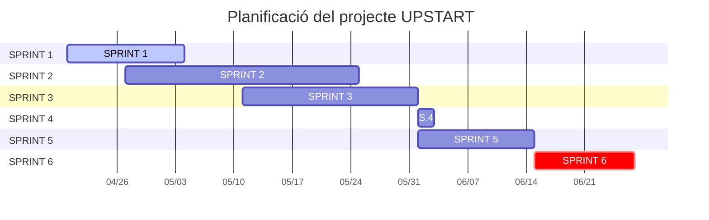

# UPSTART

## 1. Integrants del projecte
- Sukhdeep Singh
- Jordi Zalkaliani 

## 2. Objectius
## 3. Explicació del projecte

```
En aquest projecte, crearem una plataforma de mentors on pots validar la teva idea i a més opinar les idees d'altres persones. 
```
## 4. Material del projecte
## 5. Desenvolupament i desplegament
## 6. Planificació
### 7. Diagrama de Gantt

## 8. Webgrafia
## 9. Annexos

