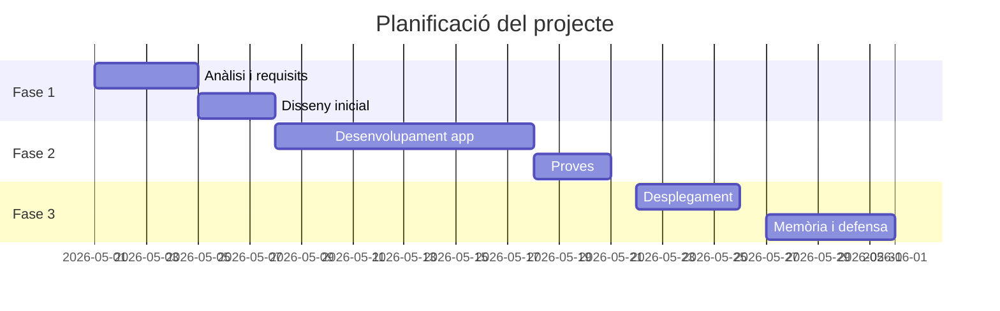

# UPSTART Diagrama Gantt

# 📅 Planificació del Projecte: Servidor Raspberry Pi i Web

## 🏃 Sprint 1: Pàgina
**OBJECTIU:** Creació d'una pàgina simple per a la comprovació del funcionament i desplegament.

### Tasca 1 (Setmana 1) - Dilluns
- [ ] Generar la pàgina web inicial.
- [ ] Pujar la pàgina al **Github Pages** i **Vercel**.
- [ ] Crear totes les pàgines i començar amb l'estructura **HTML i CSS**.

### Tasca 2 (Setmana 1) - Dimarts a Divendres
- [ ] Estructurar la pàgina web per una nota mínima per aprovar.
- [ ] Implementar imatges i botons.
- [ ] Definir l'estructura final del lloc.

---

## 📝 Sprint 2: Informe
**OBJECTIU:** Creació de l'informe per documentar el projecte i els processos.

### Tasca 1 (Setmana 1) - Dimecres a Dijous
- [ ] Documentar l'arquitectura triada.
- [ ] Seleccionar el disseny inicial.

### Tasca 2 (Setmana 2) - Divendres a Dijous
- [ ] Explicació del codi.
- [ ] Manual d'estil de colors.
- [ ] Implementar descripció de les eines utilitzades.

### Tasca 3 (Setmana 2) - Dimarts a Divendres
- [ ] Especificar el JS per saber com programar les funcions.

---

## 💎 Sprint 3: Pàgina Detallada
**OBJECTIU:** Aplicar totes les funcions i millorar la pàgina professionalment.

### Tasca 1 (Setmana 2) - Dilluns a Dimarts
- [ ] Intentar implementar **Login** i una **Base de Dades**.
- [ ] Implementar interactivitat amb **JavaScript**.
- [ ] Planificació de plans.

### Tasca 2 (Setmana 2) - Dimecres a Divendres
- [ ] Implementar **Responsive Web Design**.
- [ ] Crear sistema d'entrades i comentaris per a usuaris.

---

## 🖥️ Sprint 4: Servidor
**OBJECTIU:** Creació d’un servidor en una Raspberry Pi.

- [ ] **Tasca 1 (Setmana 3):** Configuració inicial (Dilluns).
- [ ] **Tasca 2 (Setmana 4):** Ajustos del servidor (Dilluns).

---

## 🚀 Sprint 5: Implementar
**OBJECTIU:** Implementar la pàgina web en el servidor de la Raspberry.

- [ ] **Tasca 1 (Setmana 3: L-M-X):** Desplegament inicial i proves de xarxa.
- [ ] **Tasca 2 (Setmana 3: J-V):** Configuració final de producció.

---

## 🔍 Sprint 6: Revisió
**OBJECTIU:** Revisar tot el treball realitzat.

- [ ] **Tasca 1 (Setmana 4: L-M-X):** Testeig general i depuració de bugs.
- [ ] **Tasca 2 (Setmana 4: J-V):** Preparació de l'entrega final.
