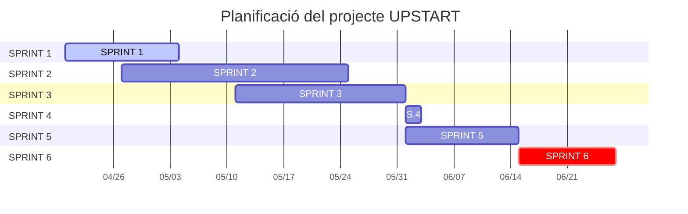

# UPSTART

## 1. Títol
## 2. Integrants del projecte
## 3. Objectius
## 4. Explicació del projecte
## 5. Material del projecte
## 6. Desenvolupament i desplegament
## 7. Planificació
### 7.1. Diagrama de Gantt

## 8. Webgrafia
## 9. Annexos

