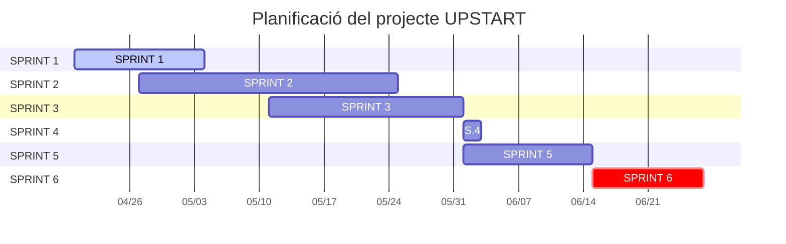

# UPSTART

## 1. Integrants del projecte
- **Sukhdeep Singh**: Responsable Tecnològic. Desenvolupament Full-stack, gestió de base de dades i sistema de gamificació.
- **Jordi Zalkaliani**:Responsable de Negoci. Gestió de la comunitat, captació de mentors i estratègia de màrqueting. 

## 2. Objectius

- Crear un entorn segur per validar idees de negoci sense por al plagi.

- Connectar el talent jove amb l'experiència de mentors consolidats a Espanya.

- Fomentar la col·laboració mitjançant un sistema de gamificació (Karma).

- Oferir una alternativa viable i adaptada al mercat local seguint models d'èxit internacionals.

## 3. Explicació del projecte

```
Upstart resol la manca de xarxa de contactes i la inseguretat dels nous emprenedors. És una aplicació web on els usuaris poden publicar els seus projectes i rebre feedback constructiu.
```

- **Usuaris Objectiu**: Joves entre 20 i 35 anys amb inquietuds empresarials.
- **Funcionalitats**:Fòrum de discussió, perfils de mentor/emprenedor, protecció de dades de la idea i sistema de recompenses per participació.

## 4. Material del projecte
## 5. Desenvolupament i desplegament
## 6. Planificació
### 7. Diagrama de Gantt

## 8. Webgrafia

1. Per crear el logo de l'empresa: [Logo UpStart](https://www.design.com/es-es)
2. Per agafar petits icones: [Icones](https://www.freepik.es/icono/sincronizar_7344967#fromView=search&page=1&position=28&uuid=d238815c-0fc8-48f8-ba84-fb5af87328bd)
3. Per els avatars dels usuaris: [Avatars](https://www.freepik.es/fotos-vectores-gratis/avatar/5#uuid=132681dc-1ea0-4add-9e4b-0d5214929669)
## 9. Annexos

