# UPSTART

## 1. Integrantes del proyecto
El proyecto ha sido desarrollado en pareja, dividiendo las responsabilidades en función de las competencias técnicas y de administración de sistemas de cada uno:

* **Sukhdeep Singh Kaur** * **Rol:** Responsable Tecnológico y Administrador de Sistemas.
    * **Responsabilidades:** Arquitectura y programación de la aplicación web, modelado de la base de datos, seguridad de los descriptores de ideas, configuración del servidor local sobre arquitectura (Raspberry Pi) y automatización de despliegues mediante contenedores.
* **Jordi Zalkaliani**
    * **Rol:** Responsable de Negocio, Diseño y Comunidad (Product Owner / Community Manager).
    * **Responsabilidades:** Diseño de la interfaz de usuario, definición de las historias de usuario del foro, gestión y verificación del panel de mentores, estrategias de marketing digital y definición del modelo financiero.

## 2. Objetivos

- Crear un entorno seguro para validar ideas de negocio sin miedo al plagio.

- Conectar el talento joven con la experiencia de mentores consolidados en España.

- Fomentar la colaboración mediante un sistema de gamificación (Karma).

- Ofrecer una alternativa viable y adaptada al mercado local siguiendo modelos de éxito internacionales.

## 3. Explicación del proyecto

**UpStart** es una plataforma web colaborativa planteada conceptualmente como el "Reddit de los fundadores". El proyecto responde a una necesidad real identificada en el ecosistema emprendedor en Cataluña: la falta de métodos eficientes y entornos de confianza para que los emprendedores noveles puedan validar si su idea de start-up puede funcionar antes de gastar recursos económicos u horas de desarrollo. Las estadísticas globales confirman que un 42% de las start-ups fracasan precisamente por lanzar productos que no cubren ninguna necesidad real del mercado.

### Público Objetivo
La plataforma se dirige específicamente a jóvenes de entre 20 y 35 años que tienen ideas de negocio anotadas pero que están paralizados por el desconocimiento, la inseguridad personal o el miedo al robo de la propiedad intelectual.

### Funcionamiento y Funcionalidades Principales
* **Embudo de Registro Ágil:** El usuario accede mediante el navegador y se registra en pocos clics a través de métodos de autenticación seguros, seleccionando su rol dentro de la comunidad.
* **Publicación de ideas:** Los creadores rellenan un formulario estructurado para poder publicar su idea.
* **Gamificación Peer-to-Peer:** Los usuarios interactúan y reciben críticas constructivas. El creador valora la utilidad de este *feedback* de 1 a 5 estrellas, haciendo que los mentores y usuarios con mejor criterio suban en el ranking público de reputación.
* **Modelo de Negocio:** Se aplica una estructura *Freemium*. El acceso y lectura básicos son gratuitos, pero se ofrece un plan Premium (5€ - 15€/mes) que habilita publicaciones ilimitadas, mejor visibilidad del proyecto en el foro y consultas privadas 1-a-1 con expertos.

## 4. Material del proyecto
- **Hardware**: Para el hardware sencillamente hemos necesitado unos equipos y conexión a internet para poder desarrollar el proyecto y una Raspberry para desplegarlo.
- **Software**: Hemos utilizado Visual Studio Code (para toda la parte de código), inteligencias artificiales (para dar soporte al código) y Supabase (para la creación de la base de datos).

## 5. Desarrollo y despliegue
Para llevar a cabo tanto el desarrollo del software como el despliegue de la infraestructura de red, se ha separado el material requerido en hardware y software:

### 5.1 Hardware
* **Equipos de desarrollo:** Ordenadores
* **Servidor local:** Raspberry Pi

### 5.2 Software
* **Tecnologías de Aplicación:** Lenguajes estándares del desarrollo web (HTML, CSS y JavaScript).
* **Entorno de desarrollo integrado:** Visual Studio Code 
* **Sistema Operativo del Servidor:** *Raspberry Pi OS Lite* ## 6. Planificación

### 7. Diagrama de Gantt

#### Sprint 1: Diseño y Maquetación Base de la App
* **Objetivo:** Creación de una página web simple para la comprobación inicial del entorno y preparación del primer despliegue de prueba.
* **Tarea 1:** * [x] Generación de la estructura base del sitio web.
    * [x] Configuración de repositorios y despliegue continuo (GitHub Pages y Vercel).
* **Tarea 2:**
    * [x] Estructuración del sitio web.
    * [x] Desarrollo del código HTML y CSS interactivo.

#### Sprint 2: Documentación Técnica y Elaboración del Informe
* **Objetivo:** Creación del informe para documentar el proyecto y los procesos de desarrollo del servidor y la página web.
* **Tarea 1:** * [x] Creación y redacción detallada del archivo README por apartados.
* **Tarea 2:**
    * [x] Descripción de las herramientas de desarrollo.
    * [x] Especificación de la lógica JavaScript.
    * [x] Creación y estructuración de la presentación final del proyecto.

#### Sprint 3: Desarrollo Avanzado y Funcionalidades de la App
* **Objetivo:** Aplicar lógica de programación avanzada para dotar a la web de características interactivas profesionales.
* **Tarea 1:** * [x] Diseño del módulo de registro (*Login*).
    * [x] Interconexión con la base de datos externa en Supabase.
* **Tarea 2:**
    * [x] Programación con JavaScript dinámico del flujo del foro (publicación de ideas).
    * [x] Estructuración técnica de las ventajas de los planes Premium.

#### Sprint 4: Configuración del Entorno de Servidor Físico
* **Objetivo:** Creación y preparación del servidor local integrado de desarrollo sobre Raspberry Pi.
* **Tarea 1:** * [x] Instalación limpia de la distribución base Linux (Raspberry Pi OS).
    * [x] Puesta en funcionamiento físico de la máquina.

#### Sprint 5: Implementación y Despliegue del Sistema
* **Objetivo:** Implementar la aplicación web dentro del servidor Linux de la Raspberry Pi para su salida a producción local.
* **Tarea 1:**
    * [x] Mejora continua de la página web.
    * [x] Pulido de detalles y funcionalidades adicionales en el entorno de producción local.

#### Sprint 6: Auditorías, Control de Calidad y Revisión Final
* **Objetivo:** Revisar de manera crítica y exhaustiva todo el trabajo realizado para garantizar la entrega del producto final.
* **Tarea 1:**
    * [x] Control de errores de la web y verificación del diseño.
    * [x] Validación de la conectividad de la Raspberry Pi.
* **Tarea 2:**
    * [x] Pruebas integrales del sistema.
    * [x] Corrección estilística final de la memoria escrita.

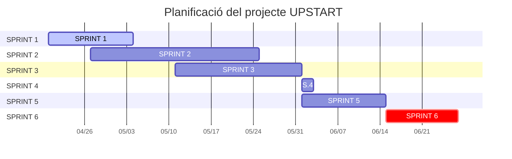
```mermaid
gantt
    title Planificació del projecte UPSTART
    dateFormat  YYYY-MM-DD
    axisFormat  %m/%d
    tickInterval 1week

    section SPRINT 1
    SPRINT 1 :active, s1, 2026-04-20, 14d

    section SPRINT 2 
    SPRINT 2 :s2, 2026-04-27, 28d

    section SPRINT 3 
    SPRINT 3 :s3, 2026-05-11, 21d

    section SPRINT 4 
    S.4 :s4_p1, 2026-06-01, 2d

    section SPRINT 5 
    SPRINT 5 :s5, 2026-06-01, 14d

    section SPRINT 6
    SPRINT 6 :crit, s6, 2026-06-15, 12d
```

## 8. Webgrafia

1. Para crear el logo de la empresa: [Logo UpStart](https://www.design.com/es-es)
2. Iconos/Avatares: [Icones](https://www.freepik.es/icono/sincronizar_7344967#fromView=search&page=1&position=28&uuid=d238815c-0fc8-48f8-ba84-fb5af87328bd)
3. Avatares de los usuarios: [Avatars](https://www.freepik.es/fotos-vectores-gratis/avatar/5#uuid=132681dc-1ea0-4add-9e4b-0d5214929669)
4. Borrar Fondo: [Remove](https://www.remove.bg/)
5. Base de datos: [Supabase](https://supabase.com/)
6. Gemini: [Gemini](https://gemini.google.com/?hl=es-ES)

## 9. Annexos

  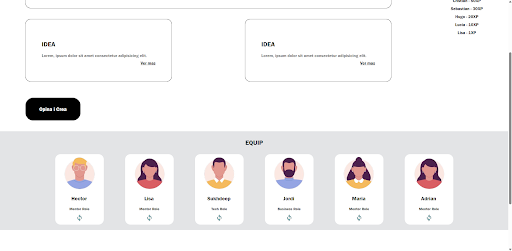
  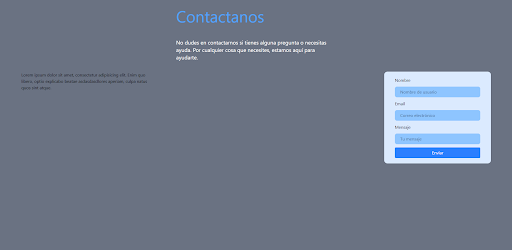
  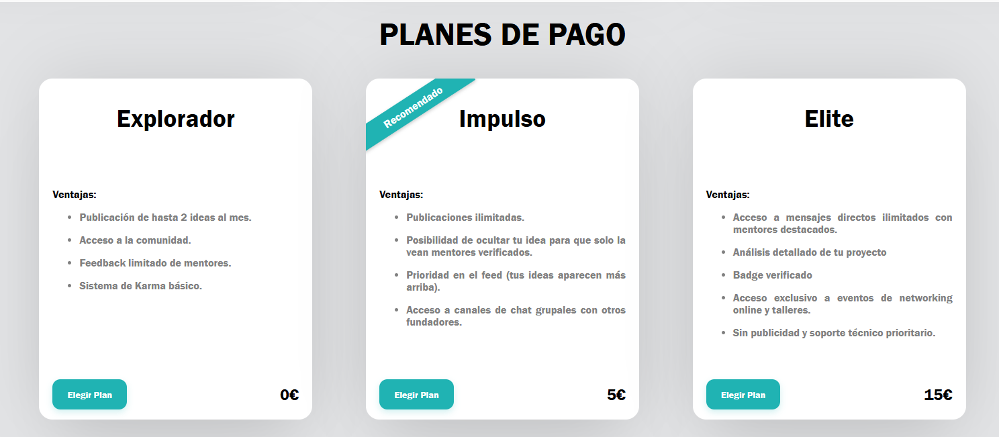
  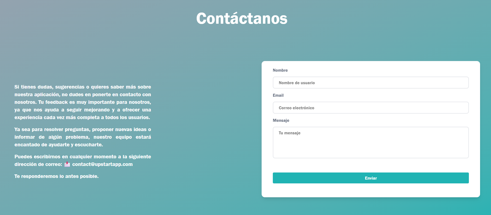
  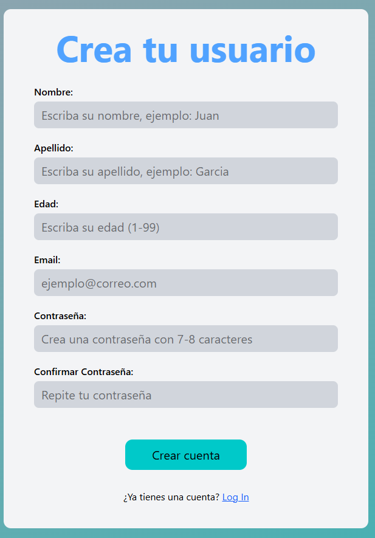
  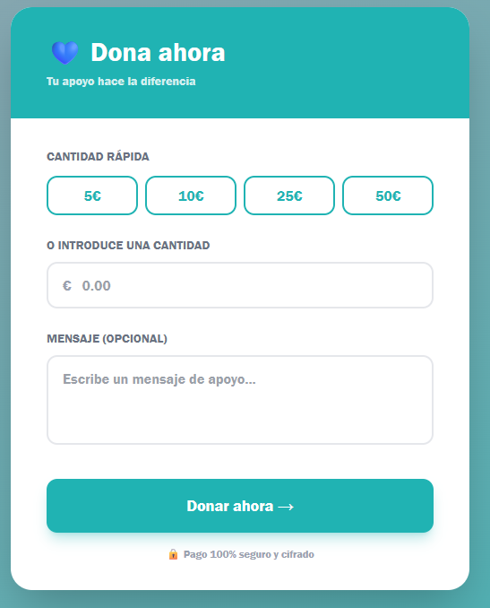
  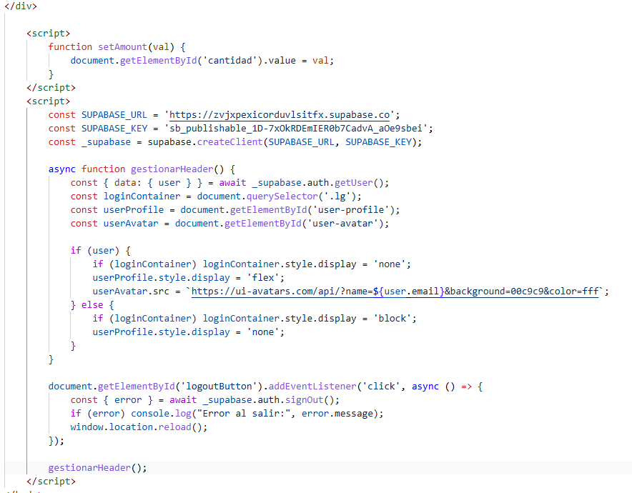
  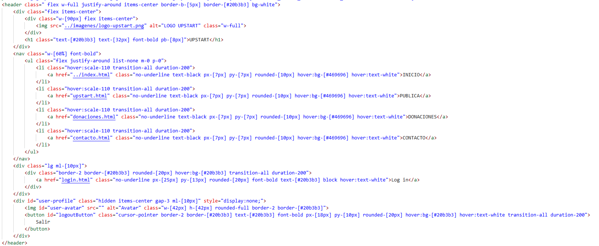
  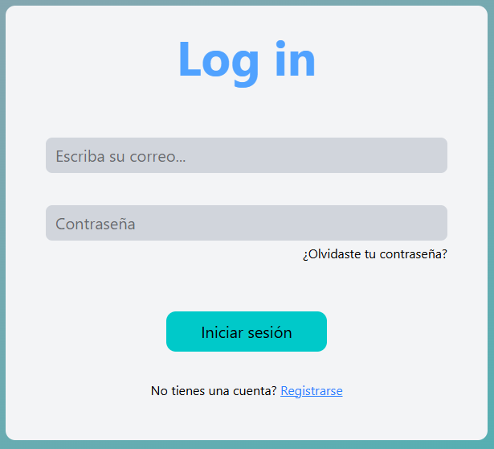
  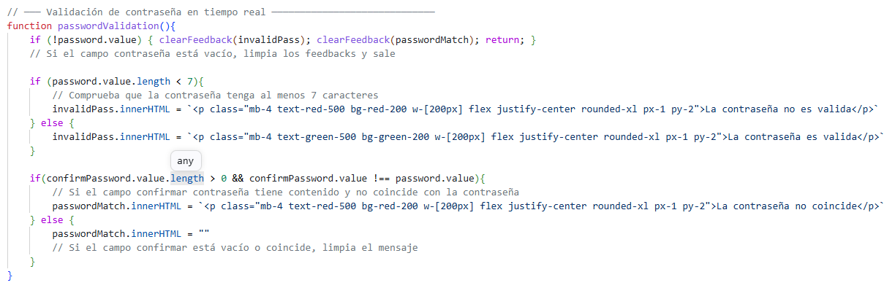
  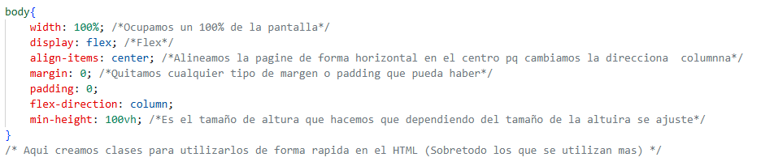
  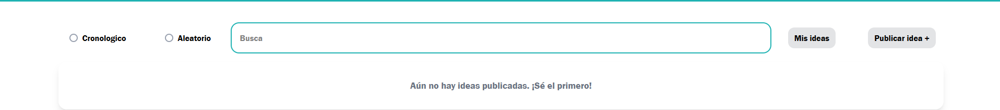
  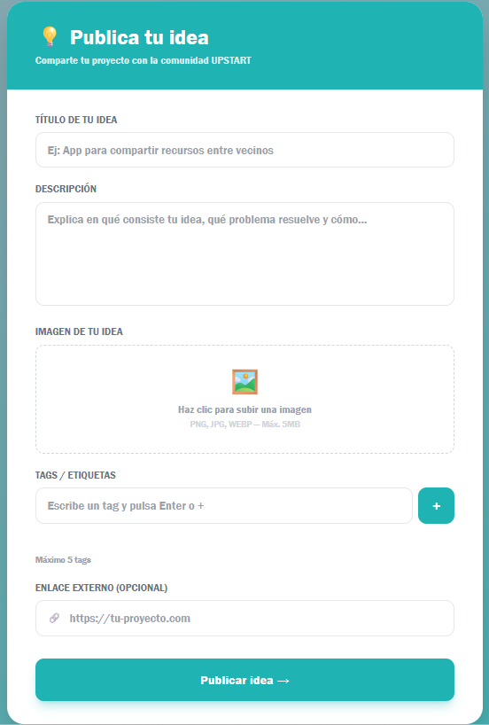
  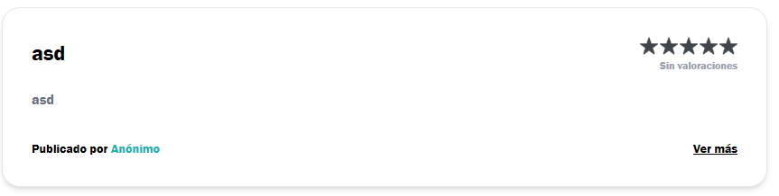
  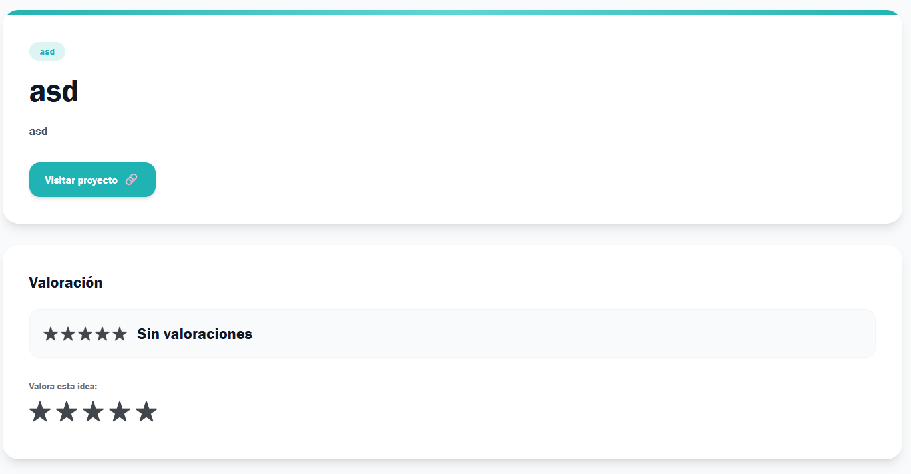

