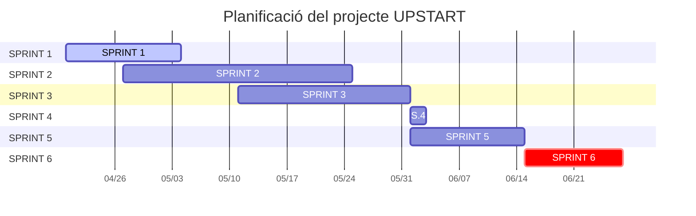

# UPSTART

## 1. Integrants del projecte
El projecte ha estat desenvolupat en parella, dividint les responsabilitats en funció de les competències tècniques i d'administració de sistemes de cadascú:

* **Sukhdeep Singh Kaur** 
    * **Rol:** Responsable Tecnològic i Administrador de Sistemes .
    * **Responsabilitats:** Arquitectura i programació de l'aplicació web , modelat de la base de dades, seguretat dels descriptors d'idees, configuració del servidor local sobre arquitectura (Raspberry Pi) i automatització de desplegaments mitjançant contenidors.
* **Jordi Zalkaliani**
    * **Rol:** Responsable de Negoci, Disseny i Comunitat (Product Owner / Community Manager).
    * **Responsabilitats:** Disseny de la interfície d'usuari, definició de les històries d'usuari del fòrum, gestió i verificació del panell de mentors, estratègies de màrqueting digital i definició del model financer.

## 2. Objectius

- Crear un entorn segur per validar idees de negoci sense por al plagi.

- Connectar el talent jove amb l'experiència de mentors consolidats a Espanya.

- Fomentar la col·laboració mitjançant un sistema de gamificació (Karma).

- Oferir una alternativa viable i adaptada al mercat local seguint models d'èxit internacionals.

## 3. Explicació del projecte

**UpStart** és una plataforma web col·laborativa plantejada conceptualment com el "Reddit dels fundadors". El projecte respon a una necessitat real identificada en l'ecosistema emprenedor a Catalunya: la manca de mètodes eficients i entorns de confiança perquè els emprenedors novells puguin validar si la seva idea de start-up pot funcionar abans de gastar recursos econòmics o hores de desenvolupament. Les estadístiques globals confirmen que un 42% de les start-ups fracassen precisament per llançar productes que no cobreixen cap necessitat real del mercat.

### Públic Objectiu
La plataforma es dirigeix específicament a joves d'entre 20 i 35 anys que tenen idees de negoci anotades però que estan paralitzats pel desconeixement, la inseguretat personal o la por al robatori de la propietat intel·lectual.

### Funcionament i Funcionalitats Principals
* **Embut de Registre Àgil:** L'usuari accedeix mitjançant el navegador i es registra en pocs clics a través de mètodes d'autenticació segurs, seleccionant el seu rol dins de la comunitat.
* **Publicació de d'idees:** Els creadors omplen un formulari estructurat per poder publicar la seva idea.
* **Gamificació Peer-to-Peer:** Els usuaris interactuen i reben crítiques constructives. El creador valora la utilitat d'aquest *feedback* d'1 a 5 estrelles, fent que els mentors i usuaris amb millor criteri pugin en el rànquing públic de reputació.
* **Model de Negoci:** S'aplica una estructura *Freemium*. L'accés i lectura bàsics són gratuïts, però s'ofereix un pla Premium (5€ - 15€/mes) que habilita publicacions illimitades, millor visibilitat del projecte al fòrum i consultes privades 1-a-1 amb experts.

## 4. Material del projecte
-**Hardware**: Per al maquinari senzillament hem necessitat uns equips i connexió a internet per poder desenvolupar el projecte i una Raspberry per desplegar-lo.
-**Software**: Hem utilitzat Visual Studio Code (per a tota la part de codi), intel·ligències artificials (per donar suport al codi) i Supabase (per a la creació de la base de dades).
## 5. Desenvolupament i desplegament
Per dur a terme tant el desenvolupament del programari com el desplegament de la infraestructura de xarxa, s'ha separat el material requerit en maquinari i programari:

### 5.1 Maquinari (Hardware)
* **Equips de desenvolupament:** Ordinadors
* **Servidor local:** Raspberry PI

### 5.2 Programari (Software)
* **Tecnologies d'Aplicació:** Llenguatges estàndards del desenvolupament web (HTML, CSS i JavaScript).
* **Entorn de desenvolupament integrat:** Visual Studio Code 
* **Sistema Operatiu del Servidor:** *Raspberry Pi OS Lite* 

## 6. Planificació

### 7. Diagrama de Gantt

#### Sprint 1: Disseny i Maquetació Base de l'App
* **Objectiu:** Creació d'una pàgina web simple per a la comprovació inicial de l'entorn i preparació del primer desplegament de prova.
* **Tasca 1:** * [x] Generació de l'estructura base del lloc web.
    * [x] Configuració de repositoris i desplegament continu (GitHub Pages i Vercel).
* **Tasca 2:**
    * [x] Estructuració del lloc web.
    * [x] Desenvolupament del codi HTML i CSS interactiu.

#### Sprint 2: Documentació Tècnica i Elaboració de l'Informe
* **Objectiu:** Creació de l'informe per documentar el projecte i els processos de desenvolupament del servidor i la pàgina web.
* **Tasca 1:** * [x] Creació i redacció detallada del fitxer README per apartats.
* **Tasca 2:**
    * [x] Descripció de les eines de desenvolupament.
    * [x] Especificació de la lògica JavaScript.
    * [x] Creació i estructuració de la presentació final del projecte.

#### Sprint 3: Desenvolupament Avançat i Funcionalitats de l'App
* **Objectiu:** Aplicar lògica de programació avançada per dotar la web de característiques interactives professionals.
* **Tasca 1:** * [x] Disseny del mòdul de registre (*Login*).
    * [x] Interconnexió amb la base de dades externa a Supabase.
* **Tasca 2:**
    * [x] Programació amb JavaScript dinàmic del flux del fòrum (publicació d'idees).
    * [x] Estructuració tècnica de les avantatges dels plans Premium.

#### Sprint 4: Configuració de l'Entorn de Servidor Físic
* **Objectiu:** Creació i preparació del servidor local integrat de desenvolupament sobre Raspberry Pi.
* **Tasca 1:** * [x] Instal·lació neta de la distribució base Linux (Raspberry Pi OS).
    * [x] Posada en funcionament físic de la màquina.

#### Sprint 5: Implementació i Desplegament del Sistema
* **Objectiu:** Implementar l'aplicació web dins del servidor Linux de la Raspberry Pi per a la seva sortida a producció local.
* **Tasca 1:**
    * [x] Millora contínua de la pàgina web.
    * [x] Poliment de detalls i funcionalitats addicionals en l'entorn de producció local.

#### Sprint 6: Auditories, Control de Qualitat i Revisió Final
* **Objectiu:** Revisar de manera crítica i exhaustiva tot el treball realitzat per garantir el lliurament del producte final.
* **Tasca 1:**
    * [x] Control d'errors de la web i verificació del disseny.
    * [x] Validació de la connectivitat de la Raspberry Pi.
* **Tasca 2:**
    * [x] Proves integrals del sistema.
    * [x] Correcció estilística final de la memòria escrita.

```mermaid
gantt
    title Planificació del projecte UPSTART
    dateFormat  YYYY-MM-DD
    axisFormat  %m/%d
    tickInterval 1week

    section SPRINT 1
    SPRINT 1 :active, s1, 2026-04-20, 14d

    section SPRINT 2 
    SPRINT 2 :s2, 2026-04-27, 28d

    section SPRINT 3 
    SPRINT 3 :s3, 2026-05-11, 21d

    section SPRINT 4 
    S.4 :s4_p1, 2026-06-01, 2d

    section SPRINT 5 
    SPRINT 5 :s5, 2026-06-01, 14d

    section SPRINT 6
    SPRINT 6 :crit, s6, 2026-06-15, 12d
```

## 8. Webgrafia

1. Per crear el logo de l'empresa: [Logo UpStart](https://www.design.com/es-es)
2. Per agafar petits icones: [Icones](https://www.freepik.es/icono/sincronizar_7344967#fromView=search&page=1&position=28&uuid=d238815c-0fc8-48f8-ba84-fb5af87328bd)
3. Per els avatars dels usuaris: [Avatars](https://www.freepik.es/fotos-vectores-gratis/avatar/5#uuid=132681dc-1ea0-4add-9e4b-0d5214929669)
4. Esborrar fons: [Remove](https://www.remove.bg/)
5. Base de dades: [Supabase](https://supabase.com/)
6. Gemini: [Gemini](https://gemini.google.com/?hl=es-ES)

## 9. Annexos

  
  
  
  
  
  
  
  
  
  
  
  
  
  
  

