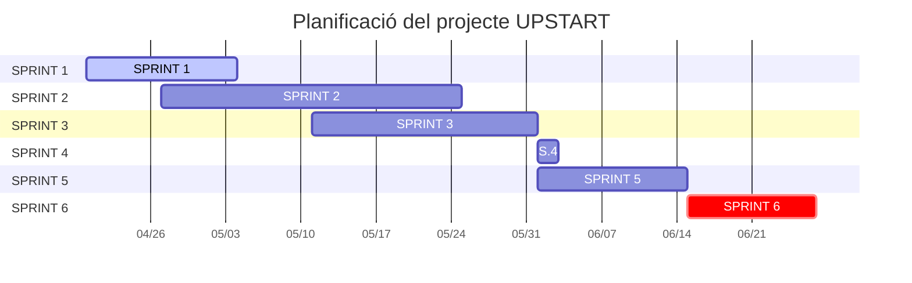

# UPSTART

## 1. Integrants del projecte
El projecte ha estat desenvolupat en parella, dividint les responsabilitats en funció de les competències tècniques i d'administració de sistemes de cadascú:

* **Sukhdeep Singh Kaur** 
    * **Rol:** Responsable Tecnològic i Administrador de Sistemes .
    * **Responsabilitats:** Arquitectura i programació de l'aplicació web , modelat de la base de dades, seguretat dels descriptors d'idees, configuració del servidor local sobre arquitectura (Raspberry Pi) i automatització de desplegaments mitjançant contenidors.
* **Jordi Zalkaliani**
    * **Rol:** Responsable de Negoci, Disseny i Comunitat (Product Owner / Community Manager).
    * **Responsabilitats:** Disseny de la interfície d'usuari, definició de les històries d'usuari del fòrum, gestió i verificació del panell de mentors, estratègies de màrqueting digital i definició del model financer.

## 2. Objectius

- Crear un entorn segur per validar idees de negoci sense por al plagi.

- Connectar el talent jove amb l'experiència de mentors consolidats a Espanya.

- Fomentar la col·laboració mitjançant un sistema de gamificació (Karma).

- Oferir una alternativa viable i adaptada al mercat local seguint models d'èxit internacionals.

## 3. Explicació del projecte

**UpStart** és una plataforma web col·laborativa plantejada conceptualment com el "Reddit dels fundadors". El projecte respon a una necessitat real identificada en l'ecosistema emprenedor a Catalunya: la manca de mètodes eficients i entorns de confiança perquè els emprenedors novells puguin validar si la seva idea de start-up pot funcionar abans de gastar recursos econòmics o hores de desenvolupament. Les estadístiques globals confirmen que un 42% de les start-ups fracassen precisament per llançar productes que no cobreixen cap necessitat real del mercat.

### Públic Objectiu
La plataforma es dirigeix específicament a joves d'entre 20 i 35 anys que tenen idees de negoci anotades però que estan paralitzats pel desconeixement, la inseguretat personal o la por al robatori de la propietat intel·lectual.

### Funcionament i Funcionalitats Principals
* **Embut de Registre Àgil:** L'usuari accedeix mitjançant el navegador i es registra en pocs clics a través de mètodes d'autenticació segurs, seleccionant el seu rol dins de la comunitat.
* **Publicació de d'idees:** Els creadors omplen un formulari estructurat per poder publicar la seva idea.
* **Gamificació Peer-to-Peer:** Els usuaris interactuen i reben crítiques constructives. El creador valora la utilitat d'aquest *feedback* d'1 a 5 estrelles, fent que els mentors i usuaris amb millor criteri pugin en el rànquing públic de reputació.
* **Model de Negoci:** S'aplica una estructura *Freemium*. L'accés i lectura bàsics són gratuïts, però s'ofereix un pla Premium (5€ - 15€/mes) que habilita publicacions illimitades, millor visibilitat del projecte al fòrum i consultes privades 1-a-1 amb experts.

## 4. Material del projecte
-**Hardware**: Per al maquinari senzillament hem necessitat uns equips i connexió a internet per poder desenvolupar el projecte i una Raspberry per desplegar-lo.
-**Software**: Hem utilitzat Visual Studio Code (per a tota la part de codi), intel·ligències artificials (per donar suport al codi) i Supabase (per a la creació de la base de dades).
## 5. Desenvolupament i desplegament
Per dur a terme tant el desenvolupament del programari com el desplegament de la infraestructura de xarxa, s'ha separat el material requerit en maquinari i programari:

### 5.1 Maquinari (Hardware)
* **Equips de desenvolupament:** Ordinadors
* **Servidor local:** Raspberry PI

### 5.2 Programari (Software)
* **Tecnologies d'Aplicació:** Llenguatges estàndards del desenvolupament web (HTML, CSS i JavaScript).
* **Entorn de desenvolupament integrat:** Visual Studio Code 
* **Sistema Operatiu del Servidor:** *Raspberry Pi OS Lite* 

## 6. Planificació

### 7. Diagrama de Gantt

#### Sprint 1: Disseny i Maquetació Base de l'App (Setmana 1)
* **Objectiu:** Creació d'una pàgina web simple per a la comprovació inicial del funcionament de l'entorn i preparació del primer desplegament de prova.
* **Tasca 1 (Dilluns):** * [x] Generació de l'estructura base de la pàgina web.
    * [x] Configuració de les plataformes de desplegament asíncron i públic (GitHub Pages i Vercel).
    * [x] Disseny de l'arbre de fitxers i creació de les pàgines inicials en codi HTML i CSS.
* **Tasca 2 (Dimarts a Divendres):**
    * [x] Estructuració del lloc web per garantir els requisits mínims de programació i disseny.
    * [x] Desenvolupament del codi HTML interactiu i fulls d'estil CSS adaptats.
    * [x] Selecció i optimització d'imatges corporatives i assets de la plataforma.
    * [x] Definició de l'estructura de navegació global i maquetació de botons d'acció.

#### Sprint 2: Documentació Tècnica i Elaboració de l'Informe (Setmanes 1 i 2)
* **Objectiu:** Creació i redacció de l'informe acadèmic per documentar el pla d'empresa, l'arquitectura triada i els processos de desenvolupament de l'aplicació web i el servidor.
* **Tasca 1 (Setmana 1 - Dimecres i Dijous):**
    * [x] Anàlisi i documentació de l'arquitectura del sistema de xarxa seleccionada.
    * [x] Definició i selecció del disseny d'interfície inicial.
* **Tasca 2 (Setmana 2 - Divendres a Dijous):**
    * [x] Escriptura de l'explicació tècnica del codi font i definició del manual d'estil (paleta de colors).
    * [x] Descripció detallada de les eines de software i entorns de programació implementats.
* **Tasca 3 (Setmana 2 - Dimarts a Divendres):**
    * [x] Especificació de la lògica de JavaScript necessària per orientar la programació de les interaccions.
    * [x] Creació i estructuració de la presentació final de defensa del projecte.

#### Sprint 3: Desenvolupament Avançat i Funcionalitats de l'App (Setmana 2)
* **Objectiu:** Aplicar la lògica de programació avançada i optimitzar la pàgina web de forma professional per dotar-la de característiques interactives.
* **Tasca 1 (Dilluns i Dimarts):**
    * [x] Recerca i disseny del mòdul de registre (*Login*) i interconnexió amb la base d'dades.
    * [x] Implementació de la interactivitat de l'usuari amb el fòrum mitjançant JavaScript dinàmic.
    * [x] Planificació i estructuració tècnica dels avantatges dels plans de subscripció Premium.
* **Tasca 2 (Dimecres a Divendres):**
    * [x] Programació del flux d'entrades de text per permetre als usuaris publicar idees i emetre opinions amb els seus comptes de perfil.

#### Sprint 4: Configuració de l'Entorn de Servidor Físic (Setmana 3)
* **Objectiu:** Creació, securització i preparació del servidor local integrat sobre una placa de desenvolupament Raspberry Pi.
* **Tasca 1 (Dilluns):**
    * [x] Instal·lació de la distribució base Linux (Raspberry Pi OS) i posada en funcionament de la màquina físicament a l'aula.

#### Sprint 5: Implementació i Desplegament del Sistema (Setmana 3)
* **Objectiu:** Implementar l'aplicació web d'UpStart dins del servidor Linux de la Raspberry Pi per a la seva sortida a producció.
* **Tasca 1 (Dilluns a Dimecres):**
    * [x] Configuració de l'entorn de producció, proxy invers i desplegament del repositori al servidor local.
* **Tasca 2 (Dijous i Divendres):**
    * [x] Auditories de xarxa per verificar el correcte funcionament públic de l'enllaç i certificar que qualsevol usuari extern pot accedir-hi.

#### Sprint 6: Auditories, Control de Qualitat i Revisió Final (Setmana 4)
* **Objectiu:** Revisar de manera crítica i exhaustiva tot el treball tècnic i teòric realitzat per garantir el lliurament del producte final.
* **Tasca 1 (Dilluns a Dimecres):**
    * [x] Control d'errors de la pàgina web i verificació del disseny adaptatiu.
    * [x] Revisió formal i correcció estilística de la memòria escrita de l'informe.
    * [x] Validació de la connectivitatde la Raspberry Pi.
    * [x] Proves integrals de funcionament global del sistema.

```mermaid
gantt
    title Planificació del projecte UPSTART
    dateFormat  YYYY-MM-DD
    axisFormat  %m/%d
    tickInterval 1week

    section SPRINT 1
    SPRINT 1 :active, s1, 2026-04-20, 14d

    section SPRINT 2 
    SPRINT 2 :s2, 2026-04-27, 28d

    section SPRINT 3 
    SPRINT 3 :s3, 2026-05-11, 21d

    section SPRINT 4 
    S.4 :s4_p1, 2026-06-01, 2d

    section SPRINT 5 
    SPRINT 5 :s5, 2026-06-01, 14d

    section SPRINT 6
    SPRINT 6 :crit, s6, 2026-06-15, 12d
```

## 8. Webgrafia

1. Per crear el logo de l'empresa: [Logo UpStart](https://www.design.com/es-es)
2. Per agafar petits icones: [Icones](https://www.freepik.es/icono/sincronizar_7344967#fromView=search&page=1&position=28&uuid=d238815c-0fc8-48f8-ba84-fb5af87328bd)
3. Per els avatars dels usuaris: [Avatars](https://www.freepik.es/fotos-vectores-gratis/avatar/5#uuid=132681dc-1ea0-4add-9e4b-0d5214929669)
4. Esborrar fons: [Remove](https://www.remove.bg/)
5. Base de dades: [Supabase](https://supabase.com/)
6. Gemini: [Gemini](https://gemini.google.com/?hl=es-ES)

## 9. Annexos

  
  
  
  
  
  
  
  
  
  
  
  
  
  
  

